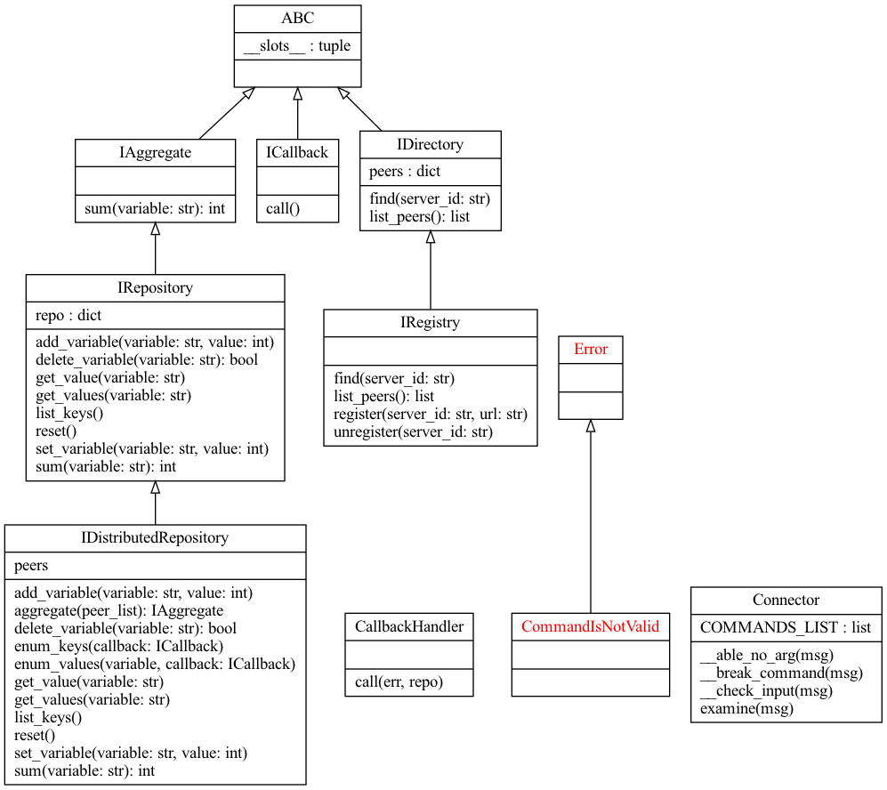

## How to Run Server:

```
python3 -m Pyro4.naming
python3 server.py <SERVER_ID> [<PEER_ID>]
```

example:

```
python3 server.py r1
python3 server.py r2 r1
```

---

## Client:

Client is Interactive.

```
python3 client.py <SERVER_ID>
```

Example:

```
python3 client.py r1
```

Example of client's Output:

```
... set a 10
OK
... set r2.a 20
OK
... add a 30
OK
... sum a
40
... DSUM a INCLUDING r1 r2
60
... DSUM a INCLUDING r1 r3
Peer r3 Is Not Existed
... set r3.b 99
Server Is Not Available
... delete a
OK
... get a
Variable Does Not Exist
... enum_keys r2
[(0, 'a')]
... enum_values r2.a
[(0, 20)]
```

---

## UML

```
pyreverse -o png -p UML  -f ALL -A -S .
```



---

## References:

https://medium.com/@__biancarosa/writing-distributed-applications-with-python-smart-objects-as-a-java-rmi-alternative-4ba9a812567d  
https://pypi.org/project/Pyro4/  
https://github.com/ShubhamRathi/Remote-Method-Invocation  
https://pyro4.readthedocs.io/en/stable/clientcode.html  
https://realpython.com/python-interface/
